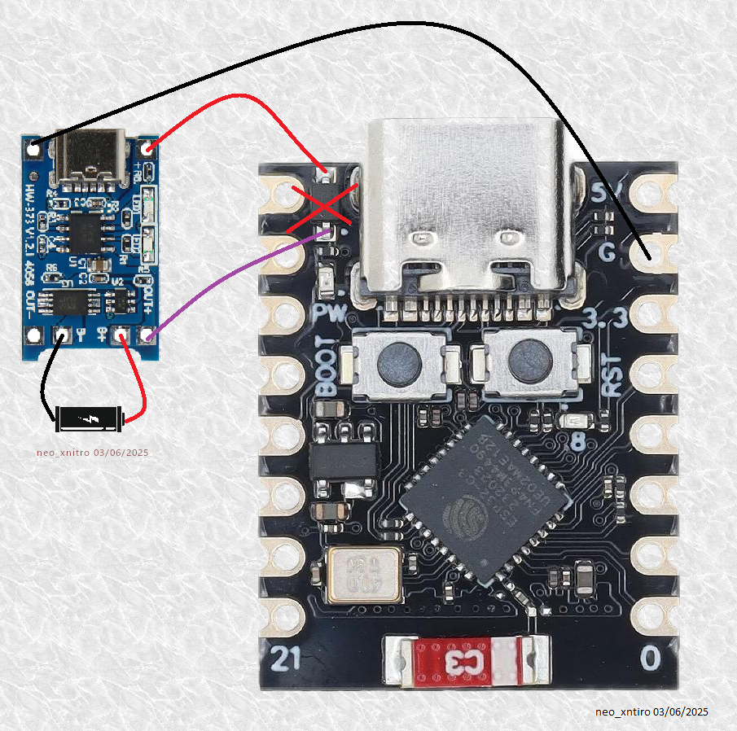
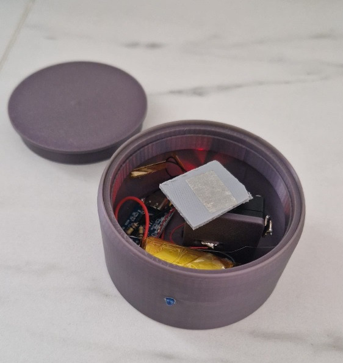

# 🐟 ESP32-C Fish Feeder Notifier

An **ESP32-C project** that sends a notification (via LED + MQTT) at **7:00 AM** and **7:00 PM** — a friendly reminder to feed my little fish.

## 🧠 Project Goal

The goal is to create a simple and autonomous system that:

- Blinks an LED at 7:00 AM and 7:00 PM to remind me to feed my fish.
- Lets me **acknowledge** the notification by pressing a button (fish is fed).
- Synchronizes time using **NTP** via Wi-Fi.
- Calculates the time remaining before the next notification.
- Enters **deep sleep mode** to minimize power consumption between reminders.

## 🧰 Features

- 🔔 LED notification twice a day
- 🔘 Button to acknowledge feeding
- 🌐 NTP time sync over Wi-Fi
- 😴 Deep sleep to preserve battery
- 📊 Sends stats to an MQTT broker (so I can track how often I forget to feed my fish)
- 🕓 Handles early feeding: if I feed my fish before the scheduled time (e.g., at 4:00 PM instead of 7:00 PM), the system will skip the upcoming notification and go straight back to sleep until the next one (in this case, 7:00 AM the next day).
- ⚠️ Resilient to failures: gracefully handles Wi-Fi, NTP, or MQTT connection issues without crashing or getting stuck.

## 🌱 Why this project?

This project is a fun way to explore:

- ESP32 deep sleep mode
- GPIO behavior during deep sleep
- NTP time synchronization
- Sending MQTT messages from an embedded device

## 📷 Preview

_(optional image or schematic here)_

## 📦 Requirements

- ESP32-C
- Wi-Fi access
- MQTT broker (optional, for stats)
- A heart big enough for one small fish ❤️

## 📷 Preview

Witness the **ESP32-C Fish Feeder Notifier** in full operation! This animated GIF showcases the system’s LED power ON at the scheduled times of 7:00 AM and 7:00 PM, signaling the fish feeding reminders. It also highlights the seamless interaction between the button press for acknowledging the feeding and the system entering its energy-efficient deep sleep mode. The visual captures the essence of this autonomous.

The Node-RED dashboard provides a sleek and intuitive interface to monitor the MQTT messages sent by the ESP32-C Fish Feeder Notifier. This image illustrates the dashboard in action, displaying real-time notifications and statistics, such as feeding confirmations and system status updates. By integrating with an MQTT broker, the system ensures I can track my fish-feeding habits (and any forgetful moments!) from anywhere, making it a powerful tool for both functionality and oversight.

To enhance the ESP32-C3’s functionality, I’ve modified it to incorporate a TP4056 battery charging module, enabling both firmware uploads and battery charging through a single USB port. This image showcases the custom hardware modifications, highlighting the compact integration of the TP4056 module with the ESP32-C3. This setup ensures the fish feeder remains powered efficiently, balancing the demands of firmware updates with reliable battery management for uninterrupted operation.

The fish feeder’s enclosure was crafted with precision using 3D printing, resulting in a compact and aesthetically pleasing box that houses the ESP32-C3 and its components. This image displays the final assembled product, showcasing the seamless integration of the electronics within the custom-designed enclosure. The 3D-printed box not only protects the system but also adds a professional touch to this heartfelt project dedicated to my fish.

---

> Built with love for my fish, and to improve my skills as a fish dad 🐠
